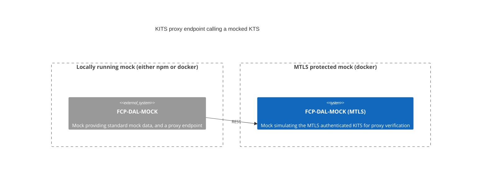

# Setting up locally for KITS MTLS

## Overview

The mock server contains endpoints to proxy on to a real KITS implementation. This can be used, for example, to verify
the schema, or just to invoke manually, in order to see what a payload response would look like, at development time.
On a deployed environment, this will be configured to point to a real KITS endpoint, such as `upgrade`

This isn't possible when running locally as there is no way to hit a deployed KITS server from your local machine.

To work around this, you can deploy a second instance of the mock, setup with MTLS enabled. This mock can then be used
to verify the proxy endpoints locally.



## Running the proxied upstream

Running the following script

```shell
./scripts/run-proxy-upstream-with-mtls-kits.sh
```

will:

- Create a MTLS directory, with all the certificates needed
- Start a docker container (`compose-mock-with-mtls.yml`), with a mock secured by MTLS

You can then directly access the mock as follows

> curl --cacert scripts/mtls/ca.crt --cert scripts/mtls/client.crt --key scripts/mtls/client.key https://localhost:3101/extapi/person/3010037/summary

(Note that the certificate CN is set to localhost with this setup)

## Configuring the main mock to use this secondary mock for it's proxied endpoint

### Fully dockerised approach

The simplest approach here is to run docker compose with both the mock and the downstream kits emulation version of
the mock. To do this, run the following script:

```shell
./scripts/run-dal-downstream-and-mtls-kits-upstream.sh
```

This generates certificates/keys needed to support MTLS and then starts two docker containers

- Standard DAL mock (dal-mock) containing
  - Standard DAL endpoints
    - /api
    - /extapi
  - Proxy Endpoint
    - /proxy
      - This uses MTLS to communicates with the KITS emulation docker image below
- The MTLS secured KITS simulator (mtls-protected-upstream-simulator), used as the upstream for the standard mock above

You can the access the KITS-emulator via the DAL mock proxy as follows:

> curl http://localhost:3100/proxy/internal/extapi/person/3010037/summary

or

> curl http://localhost:3100/proxy/external/extapi/person/3010037/summary

### Running the mock locally against a docker KITS emulator

If you want to start the DAL mock locally, without using docker, then you need to start the docker container as
described in [Running the proxied upstream](#running-the-proxied-upstream).

You then need to start the DAL mock locally, with the MTLS configuration in place (this will use the .env.mtls file
generated, when the certificates were created when starting the upstream).

```
npm run dev-with-locally-proxied-kits
```

You can then access the service on port 3001 as follows

> curl http://localhost:3001/proxy/external/extapi/person/3010037/summary
